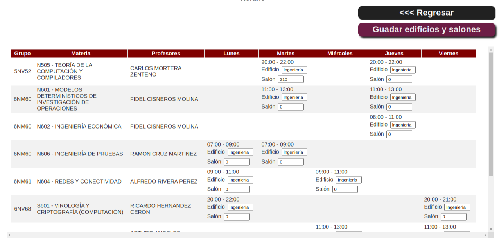
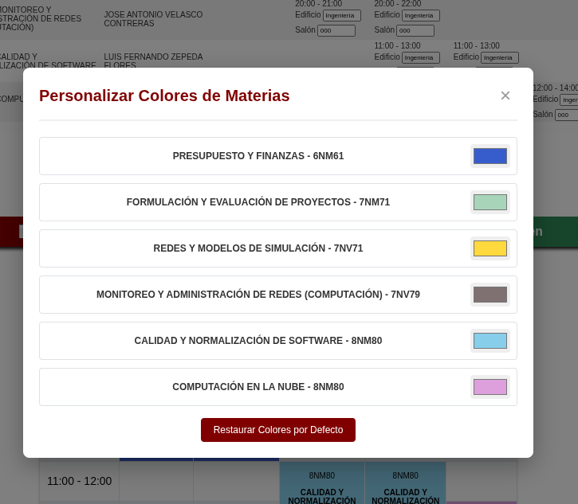

<h1 align="center">
 
  Horarios SAES
</h1>
<h4 align="center">Extensión para crear horarios limpios para el sistema SAES IPN México</h4>
<h5 align="center">Versión 1.1</h5>
 

¡Descarga la extensión!

  

Usted no tiene que hacer nada, la extensión generará tu horario limpio automáticamente, si deseas poner los edificios y salones de cada una de tus materias, lo puedes hacer ingresando dichos datos en cada cuadro de texto en tu horario y el horario limpio lo guardará automáticamente.

## 🔨 Versión 1.1

### ✨ Nueva Funcionalidad: Color Picker

Ahora puedes personalizar los colores de cada materia en tu horario:

- **Selector de colores individual**: Cada materia tiene su propio selector de color
- **Persistencia**: Los colores se guardan automáticamente en tu navegador
- **Restauración**: Botón para volver a los colores por defecto
- **Contraste automático**: El texto se ajusta automáticamente para mayor legibilidad

### ✨ Nueva Funcionalidad: Exportación mejorada de PDF e Imágen

Ahora puedes hacer la exportación directa de PDF y de Imágen (PNG)

- **Adaptado a cualquier horario**: Aunque tengas muchas materias, se adapa correctamente el horario
- **Rápido**: Ya no necesitas mandar a imprimir el horario o tomar captura para extraer el horario

  

