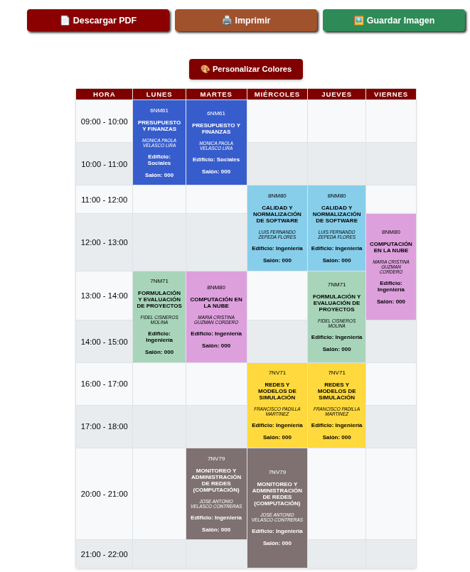
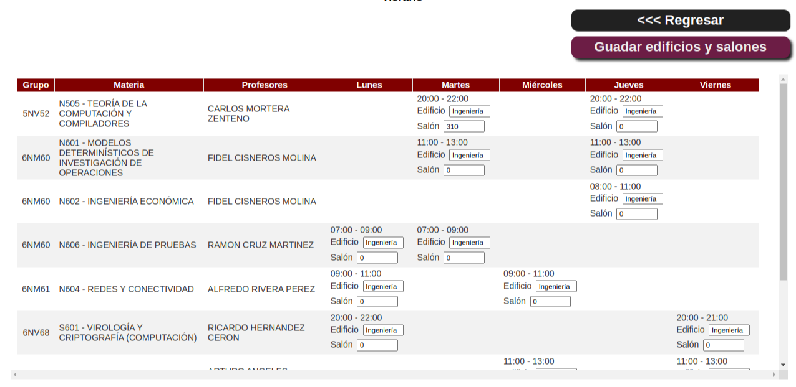
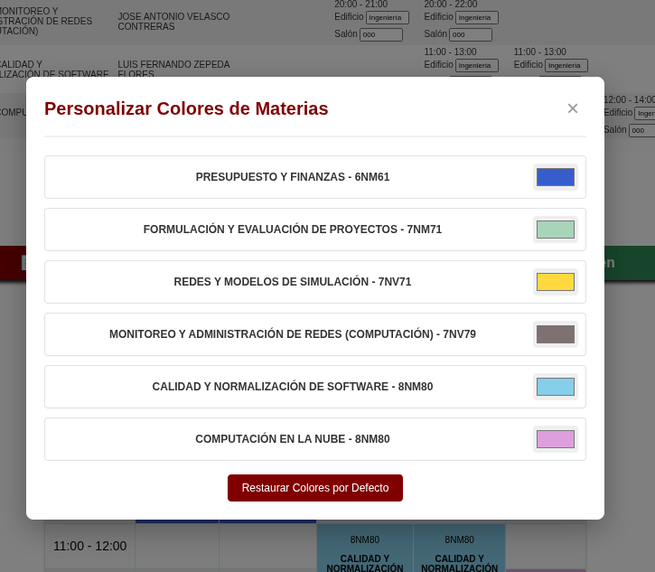

<h1 align="center">
 
  Horarios SAES
</h1>
<h4 align="center">Extensión para crear horarios limpios para el sistema SAES IPN México</h4>
<h5 align="center">Versión 1.3</h5>
 

¡Descarga la extensión!

  

Usted no tiene que hacer nada, la extensión generará tu horario limpio automáticamente, si deseas poner los edificios y salones de cada una de tus materias, lo puedes hacer ingresando dichos datos en cada cuadro de texto en tu horario y el horario limpio lo guardará automáticamente.

## 🔨 Versión 1.3

### 🔨 Fix de compatibilidad

- **[MODS SAES](https://github.com/donxd/mods-saes) de [donxd](https://github.com/donxd)**: Hubo una actualización con su extensión, provocando que esta dejara de cargar el horario, en esta versión se corrige el problema, evitando futuras actualizaciones con el horario de este dev.

### ✨ Mejoras de visualización

- **Inputs de edificios y salones**: Ahora los inputs tienen un diseño que va acorde al diseño del SAES, haciendo que también los labels e inputs no se amontonen y se rompa el diseño.

### 🚫 Eliminación de aparición en la página de reinscripciones

- **Página de reinscripciones**: En la versión anterior, el horario aparecía en las la página de reinscripción, debido a que el SAES ocupa el mismo controlador (id) para el horario de ese apartado. En esta versión, se evita la aparición de la extensión en ese apartado.

## 🔨 Versión 1.2

### ✨ Mejoras en la Visualización del Horario

- **Horario completo**: Ahora se muestran todas las horas del día, incluyendo las horas libres
- **Visualización hora por hora**: Las horas libres se muestran individualmente (ej: 10:00-11:00, 11:00-12:00) en lugar de rangos largos
- **Mejor comprensión**: Puedes ver claramente todos los espacios libres entre clases

### 📝 Nueva Funcionalidad: Exportación a Markdown

¡Ahora puedes exportar tu horario a formato Markdown!

- **Formato estándar**: Compatible con GitHub, GitLab, Obsidian y cualquier editor de Markdown
- **Repetición inteligente**: Las materias de múltiples horas se repiten en cada hora correspondiente
- **Información completa**: Incluye materia, grupo, profesor, edificio y salón en cada celda
- **Sin HTML**: Formato puro de Markdown para máxima compatibilidad
- **Descarga automática**: Se descarga como archivo `.md` con fecha incluida

### 🎯 Beneficios del Markdown

- ✅ **Documentación**: Perfecto para incluir en README o wikis de proyectos
- ✅ **Editable**: Fácil de modificar y personalizar después de exportar
- ✅ **Portable**: Compatible con cualquier plataforma que soporte Markdown
- ✅ **Legible**: Se ve bien tanto en código como renderizado

## 🔨 Versión 1.1

### ✨ Nueva Funcionalidad: Color Picker

Ahora puedes personalizar los colores de cada materia en tu horario:

- **Selector de colores individual**: Cada materia tiene su propio selector de color
- **Persistencia**: Los colores se guardan automáticamente en tu navegador
- **Restauración**: Botón para volver a los colores por defecto
- **Contraste automático**: El texto se ajusta automáticamente para mayor legibilidad

### ✨ Nueva Funcionalidad: Exportación mejorada de PDF e Imágen

Ahora puedes hacer la exportación directa de PDF y de Imágen (PNG)

- **Adaptado a cualquier horario**: Aunque tengas muchas materias, se adapa correctamente el horario
- **Rápido**: Ya no necesitas mandar a imprimir el horario o tomar captura para extraer el horario

  

